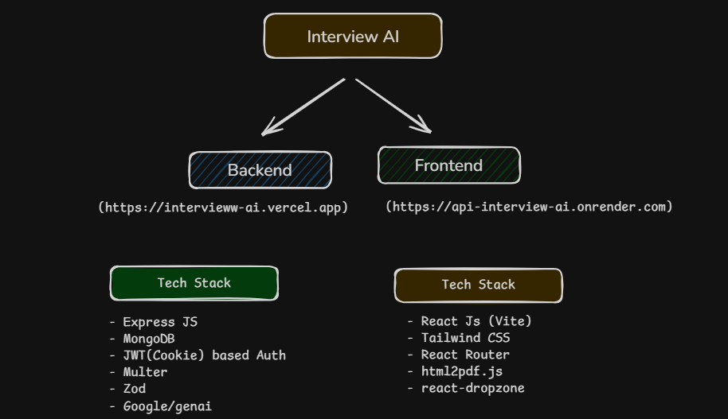
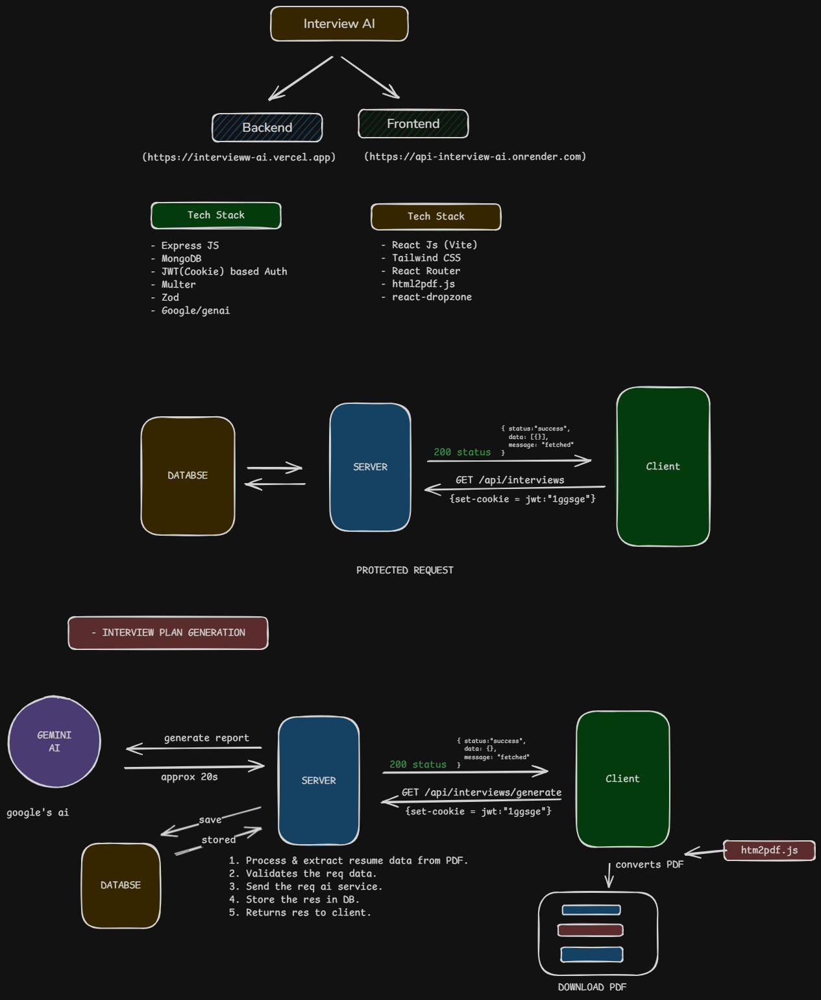
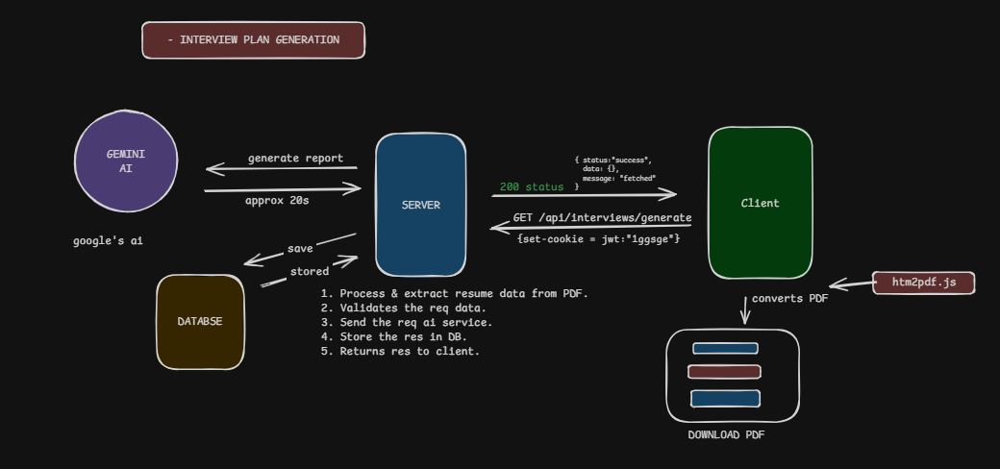

# Interview AI 🚀

AI-powered interview preparation platform that analyzes your **resume** and generates a **personalized interview preparation plan** using AI.

Users upload their resume, and the system extracts relevant information, sends it to **AI (Google Gemini)**, and generates a **structured interview preparation report** that can be downloaded as a **PDF**.

---

# 📌 Live Demo

Frontend:
[https://interview-ai.vercel.app](https://interview-ai.vercel.app)

Backend API:
[https://api-interview-ai.onrender.com](https://api-interview-ai.onrender.com)

---

# 📷 Architecture Overview

## System Overview



Interview AI is built as a **full-stack application** consisting of:

- **Frontend** (React + Vite)
- **Backend API** (Express)
- **AI Service** (Google Gemini)
- **Database** (MongoDB)

The system processes resumes, generates AI interview plans, stores results, and allows users to download them as PDFs.

---

# 🏗 System Architecture

## High Level Flow



The application consists of three primary layers:

### 1️⃣ Client (Frontend)

Responsible for:

- User interface
- Uploading resume
- Triggering interview plan generation
- Displaying results
- Downloading PDF

### 2️⃣ Server (Backend)

Responsible for:

- Authentication
- Resume processing
- Validation
- Communication with AI
- Storing results
- Serving API responses

### 3️⃣ AI Layer

Uses **Google Gemini AI** to generate:

- Interview questions
- Preparation roadmap
- Skill analysis
- Topic recommendations

---

# 🧠 Interview Plan Generation Flow



The interview generation pipeline:

1. User uploads resume (PDF)
2. Server extracts resume information
3. Data is validated
4. Server sends structured request to AI
5. AI generates interview preparation plan
6. Response stored in database
7. Client receives the result
8. Client converts report to **PDF using html2pdf.js**
9. User downloads the report

Processing time: **~20 seconds**

---

# ⚙️ Tech Stack

## Backend

- Node.js
- Express.js
- MongoDB
- JWT (Cookie based authentication)
- Multer (File Upload)
- Zod (Validation)
- Google Gemini AI

## Frontend

- React (Vite)
- TailwindCSS
- React Router
- html2pdf.js
- react-dropzone

## Deployment

- Frontend → Vercel
- Backend → Render
- Database → MongoDB Atlas

---

# ✨ Features

## Authentication

- Secure login/signup
- JWT stored in **HTTP-Only cookies**
- Protected API routes

## Resume Upload

- Upload resume in PDF format
- Uses **Multer** to handle file uploads
- Extracts text and structured information

## AI Interview Plan Generation

AI analyzes the resume and generates:

- Personalized interview questions
- Key topics to study
- Skill gap analysis
- Preparation roadmap

## PDF Report Download

Generated interview plan can be exported as **PDF**.

Uses:

```
html2pdf.js
```

for client-side conversion.

## Data Storage

All generated interview reports are saved in MongoDB.

Users can access previously generated reports.

---

# 🔐 Authentication Flow

Authentication is handled using **JWT stored in cookies**.

Flow:

1. User logs in
2. Server generates JWT
3. JWT stored in **HTTP Only Cookie**
4. Client automatically sends cookie on requests
5. Middleware verifies token
6. Protected routes become accessible

Example Request:

```
GET /api/interviews
```

Headers automatically include:

```
Cookie: jwt=token_here
```

---

# 📡 API Overview

## Base URL

```
/api
```

---

# Authentication Routes

### Sign Up

```
POST /api/auth/signUp
```

Request:

```json
{
  "username": "John_doe",
  "email": "john@gmail.com",
  "password": "password"
}
```

---

### Sign In

```
POST /api/auth/signIn
```

Response:

```
Set-Cookie: jwt=token
```

---

### Sign Out

```
POST /api/auth/signOut
```

### Get Current User

```
GET /api/auth/getCurrentUser
```

Response:

```json
{
  "status": "success",
  "data": {
    "id": "69b2b09c-8194-83a8-b266-f771949dd98",
    "username": "John_doe",
    "email": "john@gmail.com"
  },
  "message": "fetched"
}
```

---

# Interview Routes

## Get Interviews

```
GET /api/interviews
```

Response:

```json
{
  "status": "success",
  "data": [],
  "message": "fetched"
}
```

---

## Generate Interview Plan

```
GET /api/interviews/generate
```

Flow:

1. Resume uploaded
2. Data extracted
3. AI request sent
4. Response stored
5. Response returned

Response:

```json
{
  "status": "success",
  "data": {},
  "message": "fetched"
}
```

---

# 📂 Project Structure

```
interview-ai
│
├── client
│   ├── src
│   │   ├── components
│   │   ├── modules
│   │   ├── modules
│   │       ├── auth
│   │   │   │   ├── pages
│   │   │   │   ├── components
│   │   │   │   ├── hooks
│   │   │   │   ├── services
│   │       ├── interview
│   │   │   │   ├── pages
│   │   │   │   ├── components
│   │   │   │   ├── hooks
│   │   │   │   ├── services
│   │   ├── lib
│   │   └── assests
│
├── server
│   ├── controllers
│   ├── routes
│   ├── middleware
│   ├── models
│   ├── services
│   ├── validators
│   └── config
│
├── docs
│   ├── architecture.png
│   ├── flow.png
│   └── overview.png
│
└── README.md
```

---

# 🔧 Environment Variables

Create `.env` file.

## Backend

```
PORT=5000

MONGO_URI=your_mongodb_uri

JWT_SECRET=your_secret

GEMINI_API_KEY=your_google_ai_key

FRONTEND_URL=http://localhost:

NODE_ENV=dev
```

---

# 🛠 Installation

## Clone Repository

```bash
git clone https://github.com/TheGauravsahu/interview-ai.git
```

```
cd interview-ai
```

---

## Install Backend

```
cd server
npm install
```

Run server

```
npm run dev
```

---

## Install Frontend

```
cd client
npm install
```

Run frontend

```
npm run dev
```

---

# 🚀 Deployment

## Frontend

Deploy on **Vercel**

Steps:

1. Push code to GitHub
2. Import project in Vercel
3. Add environment variables
4. Deploy

---

## Backend

Deploy on **Render**

Steps:

1. Create new Web Service
2. Connect GitHub repo
3. Add environment variables
4. Deploy

---

# 📊 Performance

Average interview generation time:

```
~20 seconds
```

Depends on:

- AI processing
- Resume complexity
- Server load

---

# 🤝 Contributing

Contributions are welcome.

Steps:

```
fork repository
create feature branch
commit changes
open pull request
```

---

# 📜 License

MIT License

---

# 👨‍💻 Author

**Gaurav Sahu**

GitHub:
[https://github.com/TheGauravsahu](https://github.com/TheGauravsahu)
